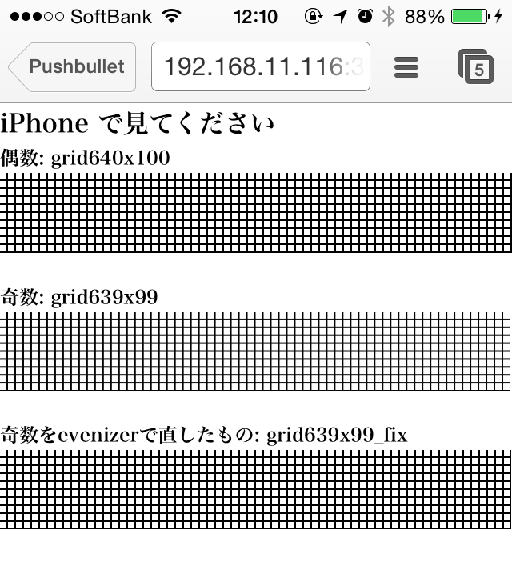
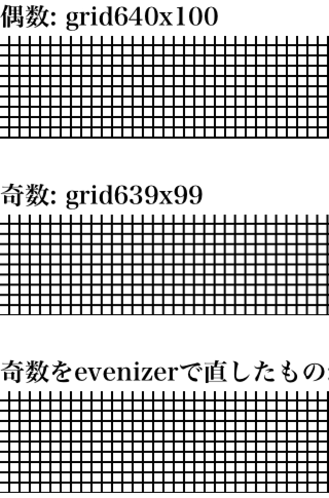

# Dist 3 Photoshopから自動で書きだした画像をちょっと手直ししよう

Photoshopの自動スライス(Generator or Slicy)にはいくつか問題がある。

* 画像によってはピクセルが奇数になる (スマホだと偶数じゃないとNG = iOSレティナ用)
* 不要メタデータがある
* jpgの圧縮ぐあいが、「Web用に保存」とはまったくちがう

ここでは上記2点をなんとかしよう。

## 奇数だとこんな感じにボケます

拡大  

## watchさせて、なんとかしよう！

* 保存 → ゴニョゴニョ → 保存先にコピー

ができたらいいなあ。

## とりあえず、奇数になってしまったピクセルを直そう

* jpgは無理
* pngだけでもやっておこう → [evenizer](https://github.com/katapad/evenizer)

## Getting Started

	npm install

### Dependencies

* [ImageOptim](http://imageoptim.com/) 1.5.1 or heigher
* [ImageOptim-CLI](https://github.com/JamieMason/ImageOptim-CLI)
* [evenizer](https://github.com/katapad/evenizer)
* Grunt

## tasks

* `grunt watch`
* `grunt iamgeTask`
* 

## 懸念

* いちいちimageOptimすると重い
    * 特に、大きいpngがすんごい時間がかかる

	